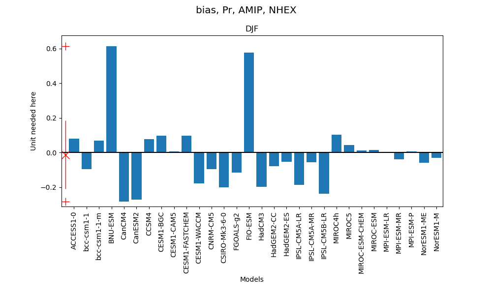
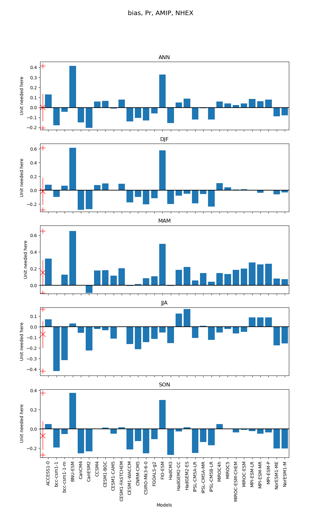

# Usage

For one season:
```
python bar_chart_bias.py -j '/Users/lee1043/Documents/Research/PMP/metrics_results/cmip5clims_metrics_package-historical/v1.1/pr_2.5x2.5_esmf_linear_metrics.json' -s 'djf' -e 'amip' -d 'NHEX' -v 'pr'
```


For all seasons:
```
python bar_chart_bias.py -j '/Users/lee1043/Documents/Research/PMP/metrics_results/cmip5clims_metrics_package-historical/v1.1/pr_2.5x2.5_esmf_linear_metrics.json' -s 'all' -e 'amip' -d 'NHEX' -v 'pr'
```

