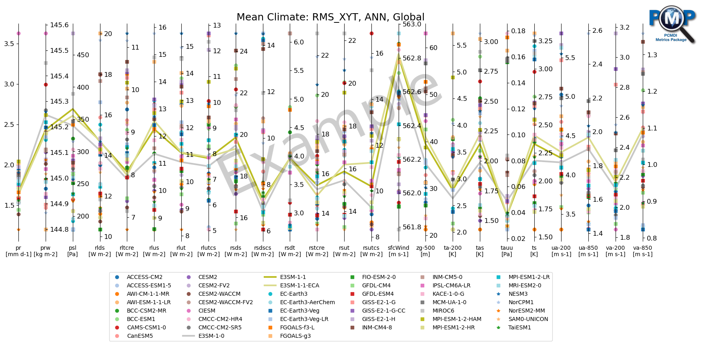

Parallel coordinate plot using matplotlib

- Example Usage: [parallel_coordinate_plot_example.ipynb](./parallel_coordinate_plot_example.ipynb)
- Practical Usage

  - Mean Climate: [parallel_coordinate_plot_mean_clim.ipynb](./parallel_coordinate_plot_mean_clim.ipynb)

    
    
  - Mean Climate, compare CMIP5 and CMIP6: [parallel_coordinate_plot_mean_clim_multiMIPs.ipynb](./parallel_coordinate_plot_mean_clim_multiMIPs.ipynb)
  
    
