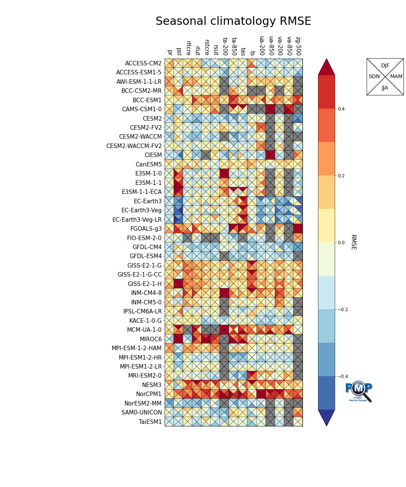

Portrait plot using matplotlib

- Example Usage: [portrait_plot_example.ipynb](./portrait_plot_example.ipynb)
- Practical Usage

  - Mean Climate: [portrait_plot_mean_clim.ipynb](./portrait_plot_mean_clim.ipynb)

    
