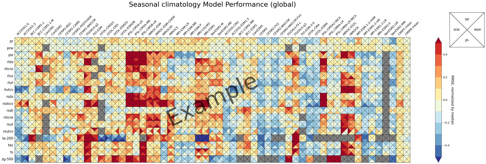

Portrait plot using matplotlib

- Example Usage: [portrait_plot_example.ipynb](./portrait_plot_example.ipynb)
- Practical Usage

  - Mean Climate: [portrait_plot_mean_clim.ipynb](./portrait_plot_mean_clim.ipynb)

    

  - Mean Climate, compare CMIP5 and CMIP6: [portrait_plot_mean_clim_multiple_CMIPs.ipynb](./portrait_plot_mean_clim_multiple_CMIPs.ipynb)

    
